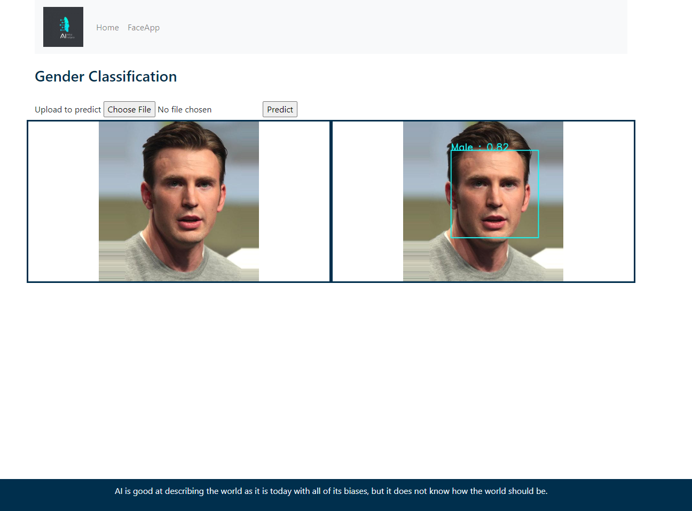

# Face Recognition WebApp-Machine_Learning in Flask

pip install -r <text file with requirements> --> enter the required packages in the text file and use this cmd to install all the packages.

IDE  -  Anaconda, Juyter Notebook

Libraries

1. numpy
2. scipy
3. matplotlib
4. pandas
5. jupyter
6. sklearn
 
opencv		 - BGR
Matplotlib	 - RGB 

Data Science = Process of extracting knowledge or information from the data
 
GrayScale image = 0.3*red array + 0.59 * green array + 0.11* blue array

## Image Pixels

len = rows * columns

For an Image we have pixel

Pixle are also called Values	=	range from 0 - (2^n - 1)

Eg : for 8 but image : n = 8 
		range of pixelvalues is 0 - 255
		
## Image Resize

1. Shrink
	cv2.INTER_AREA

2.	Enlarge
	cv2.INTER_CUBIC
	cv2.INTER_LINEAR
	
## Object Detection

Steps to Read an Image

1.Read Image
2.Conver into GrayScale
3.Apply Cascade Classifier

[[ x  y w h]]

cv2.rectangle(img,(x,y),(x+w,y+h),( )

## Machine Learning	-	Pipeline Architecture

## Project Overview

Objective : Create a Gender Classification Model and Integrate to Flask App.

	1.	Task is to develop a Machine Learning Model which should automatically detect faces and classify genders.
	
Deliverables:
	
	1. Develop a Flask App and integrate a machine learning model.
	2. User will upload a image and app has to detect the face and identify gender

Model Evaluation

- Confusion Matrix
- Recall,precision, Accuracy
- Kappa Score
- ROC & AUC

Flask

Flask ia a lightweight ESGI (Web Server Gateway Interface) Web application framework

--> It is designed to make quick and essay web app
--> Has ability to scale up complex applications
--> Wrriten in python

Requirements:
HTML, CSS, JS

Default host : 127.0.0.1(localhost)
default port : 5000
default debug: Flase

Jinja

Jinja is a modern and designer-friendly templating language for python, modelled after Django's templates.

--> It is fast, widely used and secure with the optional sandboxed template execution environment

The Jinja2 template engine uses the following delimiters for escaping from HTML.

1)  for statements
	--> if else conditions, for loops,extending,blocking etc.
2) {{..}} for expressions to print to the template output
3) {#..#} for comments not included in the template output
4) #..## for Line Statements

Can expect 60% Accurate Gender Prediction
 
For testing this Face Recognition, Download this github file.
 
To install virtual environment
 
Window: - pip install –user virtualenv (Enter in your anaconda prompt)
 
For Linux: - python3 -m install –user virtualenv

Execute this command to activate Virtual environment (freeai) =. \freeai\Scripts\activate

Step 1: Home Page

Chick the FaceApp button in the Navbar to move the next stage of this project

Step2: FaceApp

Step3: Test:

Upload the image, and press predict for face recognition.

Test 1:

Test 2:

If you have any issues, do let me know in comment!!!!
